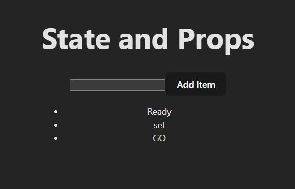

# React State Exercise

## Goal
Create a todo list that can be viewed by the user, and a form where the user can add new items to the todo list stored in state.

### Structure
Create the basic layout using JSX (remember that JSX is essentially just HTML)
- Keep it static (basic) for now; add in the extra functionality as you go later
1. Add an h1 with a simple title
1. Create a form that holds a text input and a button
1. Create an empty unordered list

### State
Create two state variables
1. For the input field's text (initialized to an empty string)
1. For the list of items in the actual todo list (initialized to `["Ready", "Set", "GO"]`)

### Render the list
Map over the list to generate the list item elements
1. Inside of the ul tag, put curly braces to "escape back to JavaScript"
1. Inside those curly braces map over the array `list.map()`
1. Inside the map callback function, pick up the element and index variables, and then return a li
1. Give the li a key prop and have it display the element variable `<li key={????}>{list}</li>`

### Controlled Input
We want to synchronize the input element's display with React's state. We do that by manually setting it's value.
1. Give the input element a value property and set it equal to our first piece of state - the input field's text.

### Handle the onChange event
1. Give the input element an `onChange={}` event.
1. Set it equal to a function (could be an inline function or one declared elsewhere in the component)
1. The function should accept an event variable as a parameter
1. It should then set the text state variable to be the value of the element that triggered the change event: `event.target.value`

### Handle the onSubmit event
1. Give the form element an `onSubmit={}` event.
1. Set it equal to a function (could be an inline function or one declared elsewhere in the component)
1. That function should accept an event variable as a parameter
1. Have the function invoke `event.preventDefault()` to prevent the browser refresh
1. Set your `list` state variable to be a new array with ALL the previous items in `list`, as well as one more item - the current text state variable (the same one that we update in the onChange event).